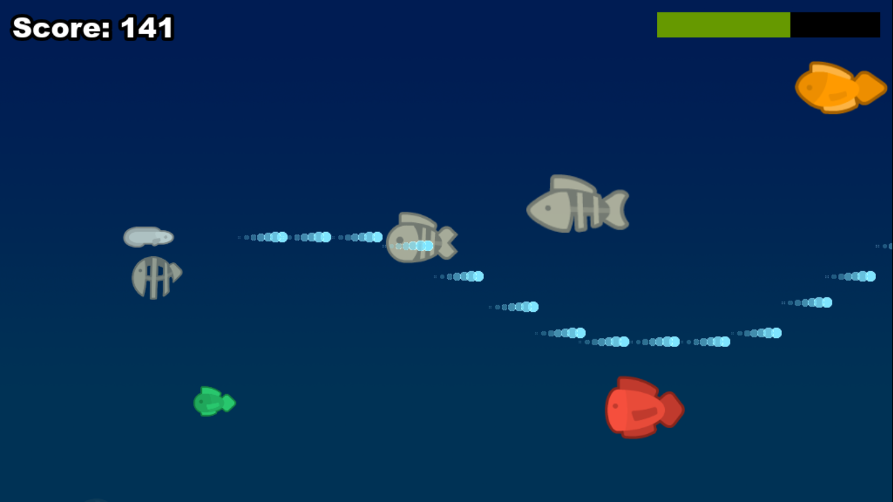

# Eel Fighter

A horizontal scrolling shooter game where you control an electric eel battling
through waves of enemy fish.

It is a mini-game to learn how to code a game from A to Z with
Phaser; it is a demonstration whose initial architecture is provided by a Phaser
template.

This is created from a Phaser 3 project template that uses Vite for bundling. It
supports hot-reloading for quick development workflow, includes TypeScript
support and scripts to generate production-ready builds.

**[This Template is also available as a JavaScript version.](https://github.com/phaserjs/template-vite)**

### Versions

This game has been updated for:

- [Phaser 3.80.1](https://github.com/phaserjs/phaser)

## Requirements

[Node.js](https://nodejs.org) is required to install dependencies and run
scripts via `yarn` or `npm`.

## Available Commands

### yarn

| Command         | Description                                    |
|-----------------|------------------------------------------------|
| `yarn`          | Install project dependencies                   |
| `yarn dev`      | Launch a development web server                |
| `yarn build`    | Create a production build in the `dist` folder |

### npm

| Command         | Description                                    |
|-----------------|------------------------------------------------|
| `npm install`   | Install project dependencies                   |
| `npm run dev`   | Launch a development web server                |
| `npm run build` | Create a production build in the `dist` folder |

## Deploying to Production

After you run the `yarn build` command, your code will be built into a single
bundle and saved to the `dist` folder, along with any other assets your project
imported, or stored in the public assets folder.

In order to deploy your game, you will need to upload *all* of the contents of
the `dist` folder to a public facing web server.

## Join the Studio Ouebsson community

**Visit:** the [Studio Ouebsson website](https://studio.ouebsson.fr) and discover our games.
**Play:** with our first [Abyssus Scroll](https://abyssus-scroll.adu.games/) game.
**Discover:** our next MMO strategy game [Abyssus Deep Under](https://www.abyssus-deep-under.com/).
**Follow:** us on [Instagram](https://www.instagram.com/abyssus.deepunder/), [Linkedin](https://www.linkedin.com/in/aby-le-poulpe-%F0%9F%90%99-a46a5629a/) or [Discord](https://discord.gg/GuCfSxuJcN).

Ouebsson is a protected trademark in France &copy; 2023 - 2024.

Abyssus is a protected trademark in France and The European Union &copy; 2023 - 2024.

The Phaser logo and characters are &copy; 2011 - 2024 Phaser Studio Inc.

All rights reserved.
