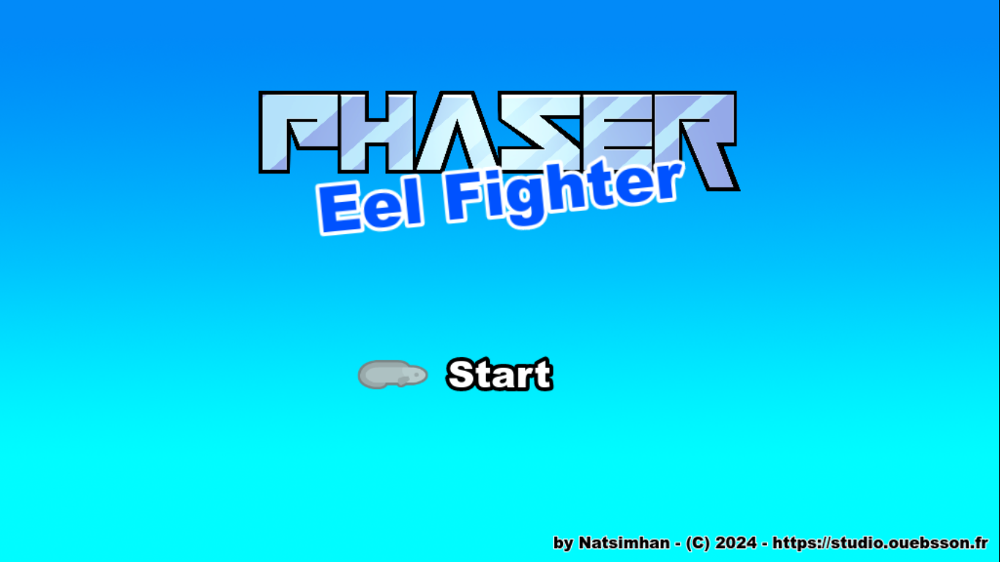

# Eel Fighter: Learn Game Development with Phaser



## Introduction
**Eel Fighter** is a horizontal scrolling shooter game where you control an electric eel battling through waves of enemy fish. This mini-game is designed to teach you how to code a game from start to finish with Phaser. It is based on an initial architecture provided by a Phaser template.

**[Play Now!](https://natsimhan.github.io/eel-fighter/)**

## Game Features
- Control an electric eel with special attacks.
- Face waves of enemy fish.
- Immersive graphics and sounds.

## Screenshot

*See the game in action!*

## Online Demo
**[Play directly in your browser](https://natsimhan.github.io/eel-fighter/)**

## Versions
- **Phaser 3.80.1**: [Link to repository](https://github.com/phaserjs/phaser)

## Requirements
To install dependencies and run scripts, [Node.js](https://nodejs.org) is required.

## Installation
Clone the repository and install the dependencies:

```bash
git clone https://github.com/natsimhan/eel-fighter.git
cd eel-fighter
yarn
```

## Available Commands

| Command         | Description                                    |
|-----------------|------------------------------------------------|
| `yarn`          | Install project dependencies                   |
| `yarn dev`      | Launch a development web server                |
| `yarn build`    | Create a production build in the `dist` folder |

## Deploying to Production

After running the `yarn build` command, all the contents of the `dist` folder 
should be uploaded to a public web server.

## Join the Studio Ouebsson community

- **Visit** the [Studio Ouebsson website](https://studio.ouebsson.fr) to discover our games.
- **Play** our first game [Abyssus Scroll](https://abyssus-scroll.adu.games/).
- **Discover** our upcoming MMO strategy game [Abyssus Deep Under](https://www.abyssus-deep-under.com/).
- **Follow** us on [Instagram](https://www.instagram.com/abyssus.deepunder/), [Linkedin](https://www.linkedin.com/in/aby-le-poulpe-%F0%9F%90%99-a46a5629a/) or [Discord](https://discord.gg/GuCfSxuJcN).

Ouebsson is a protected trademark in France &copy; 2023 - 2024.

Abyssus is a protected trademark in France and The European Union &copy; 2023 - 2024.

The Phaser logo and characters are &copy; 2011 - 2024 Phaser Studio Inc.

All rights reserved.

## Assets Credits

- Images : [Fish pack](https://kenney.nl/assets/fish-pack) by Kenney
- Sounds : 
  - `bubbles-1.wav` by Glaneur de sons, [Freesound](https://freesound.org/s/104949/), License: Attribution 4.0
  - `game-over-arcade.wav` by Mountain_Man, [Freesound](https://freesound.org/s/382310/), License: Creative Commons 0
